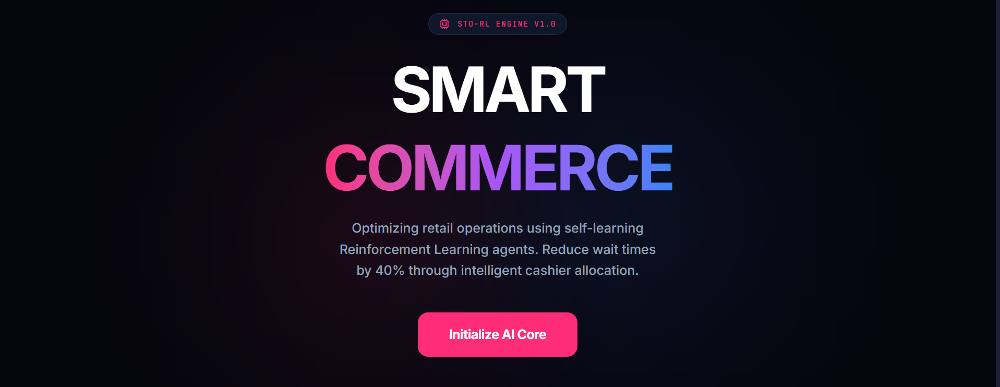
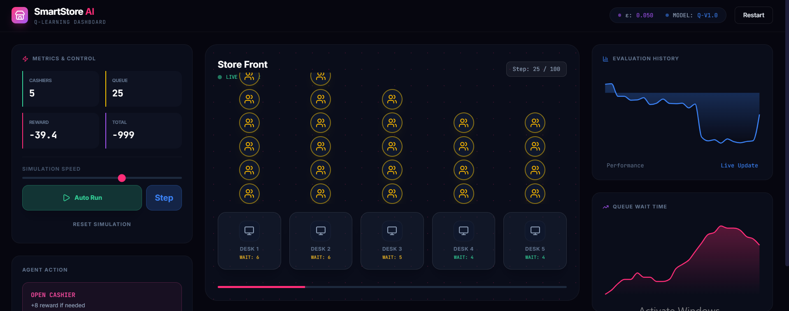

# 🛒 Smart Cashier


[](https://python.org)
[](https://react.dev)
[](https://en.wikipedia.org/wiki/Reinforcement_learning)
[](https://en.wikipedia.org/wiki/Q-learning)
[](https://en.wikipedia.org/wiki/SARSA_%28algorithm%29)
[](https://numpy.org)
[](LICENSE)

---


### 🤖 Smart Cashier Optimization & Intelligent Queue Management

> **Optimize every queue. Minimize every wait.**
> A Reinforcement Learning-based intelligent cashier system designed to optimize customer distribution across **5 cashiers**. The agent learns to select the most suitable cashier for each incoming customer based on the current queue state, receiving higher rewards as customer waiting time decreases. The project implements and compares **Q-Learning** and **SARSA** to evaluate different learning strategies for intelligent queue optimization.

---


## 🎯 Project Objective

The primary objective is to:

> **Minimize customer waiting time by intelligently distributing customers across the five available cashiers.**

The agent learns through repeated interaction with the simulated environment.

As the waiting time decreases:

```text
Lower Waiting Time → Higher Reward
Higher Waiting Time → Lower Reward
```

The learned policy should therefore favor cashier assignments that result in shorter queues and lower overall waiting time.

---

## 📸 Demo 




---




---


# 🧠 Reinforcement Learning Environment

The cashier allocation problem is modeled as a Markov Decision Process (MDP).

### 👤 Agent

The **RL Agent** is responsible for deciding which cashier should be assigned to each incoming customer.

### 🌍 Environment

The environment represents the checkout system and contains:

* 5 cashiers
* Customer arrivals
* Cashier queues
* Service times
* Customer waiting times
* Reward calculation

### 📊 State

The state represents the current condition of all cashier queues.

For example:

```text
State = [Queue₁, Queue₂, Queue₃, Queue₄, Queue₅]
```

The state changes whenever customers arrive, join queues, or finish being served.

### 🎮 Actions

For every incoming customer, the agent selects one of the five cashiers:

```text
Action ∈ {
    Cashier 1,
    Cashier 2,
    Cashier 3,
    Cashier 4,
    Cashier 5
}
```

### 🏆 Reward

The reward function encourages the agent to minimize customer waiting time.

A shorter waiting time results in a higher reward, while longer waiting times result in lower rewards.

This creates the learning objective:

```text
Minimize Waiting Time
          ↓
   Maximize Reward
```

---

# 🔄 Algorithms

## 1. Q-Learning

**Q-Learning** is an **off-policy Reinforcement Learning algorithm**.

It learns the expected long-term value of taking an action in a particular state and aims to discover the optimal policy.

In this project, Q-Learning learns which cashier should be selected for each state to minimize future customer waiting time.

### Why Q-Learning?

Q-Learning is important in this project because:

* It learns an optimal policy.
* It considers long-term future rewards.
* It provides a strong baseline for the cashier allocation problem.
* Its off-policy nature allows it to learn the optimal policy independently of the agent's current behavior.
* It is relatively simple and effective for discrete state/action spaces.

---

## 2. SARSA

**SARSA** is an **on-policy Reinforcement Learning algorithm**.

Unlike Q-Learning, SARSA learns from the actions that the agent actually takes while interacting with the environment.

The name SARSA comes from:

```text
State → Action → Reward → State → Action
```

### Why SARSA?

SARSA is important because:

* It learns the policy actually being followed.
* It takes exploration into account during learning.
* It can produce more conservative behavior during exploration.
* It provides a meaningful comparison against Q-Learning.
* It helps evaluate how on-policy learning performs in the cashier allocation environment.

---

# ⚔️ Q-Learning vs SARSA

| Feature           | Q-Learning                                | SARSA                           |
| ----------------- | ----------------------------------------- | ------------------------------- |
| Learning Type     | Off-Policy                                | On-Policy                       |
| Policy            | Learns optimal policy                     | Learns current behavior policy  |
| Exploration       | Less directly reflected in learned policy | Directly reflected              |
| Main Strength     | Optimization toward optimal policy        | Considers actual behavior       |
| Learning Strategy | Greedy target policy                      | Behavior policy                 |
| Role in Project   | Optimal allocation baseline               | On-policy allocation comparison |


---

# 🏗️ System Architecture

```text
                  👤 Customer Arrives
                          │
                          ▼
                ┌───────────────────┐
                │   RL Environment  │
                │                   │
                │    5 Cashiers     │
                │    Queue States   │
                └─────────┬─────────┘
                          │
                          ▼
                  ┌──────────────┐
                  │   RL Agent   │
                  └──────┬───────┘
                         │
              ┌──────────┴──────────┐
              ▼                     ▼
       ┌─────────────┐       ┌─────────────┐
       │ Q-Learning  │       │    SARSA    │
       │ Off-Policy  │       │  On-Policy  │
       └──────┬──────┘       └──────┬──────┘
              │                     │
              └──────────┬──────────┘
                         ▼
                  Select Cashier
                         │
                         ▼
                  Customer Served
                         │
                         ▼
                 Calculate Waiting
                         │
                         ▼
                    Get Reward
                         │
                         ▼
                  Update Q-Values
                         │
                         ▼
                   Next Customer
```

---


### ⏱️ Average Waiting Time

Measures the average amount of time customers spend waiting.

**Lower is better.**

### 🏆 Average Reward

Measures how effectively the agent achieves its objective.

**Higher is better.**

### 📈 Total Reward

Measures the accumulated reward throughout the simulation.

**Higher is better.**

### ⚖️ Cashier Utilization

Measures how efficiently the five cashiers are being utilized.

A good policy should avoid heavily overloaded cashiers while leaving others underutilized.

### 👥 Customer Distribution

Measures how customers are distributed among the five cashiers.

---


# 🛠️ Technologies & Tools

* **Python**
* **Reinforcement Learning**
* **Q-Learning**
* **SARSA**
* **NumPy**
* **Pandas**
* **Matplotlib**
* **Jupyter Notebook**
* * **React**

---

# 📂 Project Structure

```text
Smart-Cashier/
│
│
├── src/
│   ├── App.tsx
│   ├── index.css
│   ├── main.tsx
│   ├── types.ts
│  
├── index.html
├── SmartStore_RL_Project.ipynb/
├── requirements.txt
├── README.md

```

---

# 🚀 Installation


Install the required dependencies:

```bash
pip install -r requirements.txt
```

---

# ▶️ Usage


1. Install dependencies:

   ```bash
   npm install
   ```

2. Run the application:

   ```bash
   npm run dev
   ```

3. Open the local development server in your browser and start experimenting with the Smart Cashier system.


---


## 👥 Team

Developed by a team of 6 members.

---
  
<div align="center">

⭐ **If this project helped you, consider giving it a star !** ⭐

</div>
